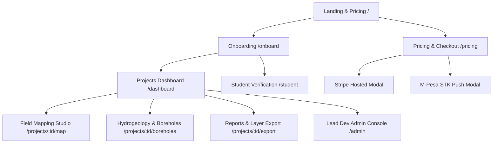

# 🧭 GeoQuerry Frontend Implementation & Page Architecture Blueprint

This document outlines everything built in the **GeoQuerry Backend API** that is ready for frontend integration, complete with page-by-page specifications, endpoint mappings, and TypeScript contracts.

---

## 🌐 1. Backend Server & Auth Configuration

* **Base API URL**: `http://localhost:5000/api`
* **Interactive OpenAPI / Swagger UI**: `http://localhost:5000/api/docs`
* **Authentication Header**:
  ```http
  Authorization: Bearer <JWT_TOKEN>
  ```
  *(Or in local development testing: `x-user-id: <USER_ID>` and `x-user-email: <EMAIL>`)*

---

## 📱 2. Pages to Build & Endpoint Mapping



---

### 🏠 Page 1: Landing & Pricing Showcase (`/`)
* **Purpose**: Hero banner, value proposition for mining firms and field geologists, feature comparisons, and live pricing cards.
* **Backend Integrations**:
  * `GET /api/pricing/plans`: Fetches available plans (`Free Explorer`, `Professional`, `Enterprise`) with feature matrices and dual pricing in **USD** and **KES**.

---

### 🔐 Page 2: User Onboarding & Setup (`/onboard`)
* **Purpose**: First-time user profile setup after authentication (Clerk, Supabase, Neon Auth, Firebase).
* **Components to Build**:
  * Full name & username input with real-time debounce availability check.
  * Country selector (auto-infers currency e.g. `KE` $\rightarrow$ `KES`, `US` $\rightarrow$ `USD`).
  * Auto-calculated Benefit Badge showing **40% Beta Developer discount**, **70% Student discount**, or **100% Core Dev badge**.
* **Backend Integrations**:
  * `GET /api/profiles/check-username/:username`: Real-time availability validator.
  * `POST /api/profiles/onboard`: Creates profile and auto-calculates best tier.
  * `GET /api/profiles/:userId`: Fetches user profile.

---

### 📊 Page 3: Projects Dashboard (`/dashboard`)
* **Purpose**: Displays the user's geological survey projects with usage meters.
* **Components to Build**:
  * Project grid/cards with type badges (`Field Mapping`, `Hydrogeology`, `Mining`, `Geotechnical`).
  * **Free Plan Quota Meter**: Display project count indicator (`e.g. 2 / 3 Projects used`).
  * Project creation modal with boundary coordinates and bounding box input.
* **Backend Integrations**:
  * `GET /api/projects`: Lists user projects.
  * `POST /api/projects`: Creates a project *(enforces 3-project cap for Free users)*.
  * `GET /api/projects/:id`: Detailed project view with collaborators.

---

### 🗺️ Page 4: Field Mapping & Outcrop Studio (`/projects/:id/map`)
* **Purpose**: Interactive map (Mapbox / Leaflet / MapLibre) showing observation stations, outcrop exposures, and rock samples.
* **Components to Build**:
  * Map canvas with GPS accuracy circles and clustering.
  * Station creation drawer: Code (`ST-01`), weathering, outcrop exposure (`in-situ`, `float`), rock sample bag IDs, and photo uploads.
  * 3D Structural Measurement input (Strike, Dip Angle, Dip Direction, Fold Type).
  * **Free Plan Quota Warning**: Alerts user when approaching 50 stations/project.
* **Backend Integrations**:
  * `GET /api/stations`: Lists stations (with search query support `?q=Gneiss`).
  * `POST /api/stations`: Creates station *(enforces 50 stations cap on Free plan)*.
  * `POST /api/uploads/presigned-url`: Direct upload URL for photos.
  * `POST /api/stations/:id/rocks`: Adds rock sample.
  * `POST /api/stations/:id/structures`: Records dip/strike measurements.

---

### 💧 Page 5: Hydrogeology & Borehole Explorer (`/projects/:id/boreholes`)
* **Purpose**: Specialized hydrogeological survey logs for drilling contractors and water engineers.
* **Components to Build**:
  * Borehole table with SWL (Static Water Level), DWL (Dynamic Water Level), and yield/discharge rates.
  * Lithology column visualizer (depth intervals with rock strata coloring).
  * VES Geophysical resistivity soundings and pumping test logs.
* **Backend Integrations**:
  * `GET /api/boreholes`: Lists project boreholes.
  * `POST /api/boreholes`: Records borehole logs and lithology intervals.

---

### 💳 Page 6: Pricing & Subscription Checkout (`/pricing` or `/upgrade`)
* **Purpose**: Dynamic pricing calculator and checkout modal.
* **Components to Build**:
  * **Currency Toggle**: Switch between **USD ($)** and **KES (KSh)**.
  * **Billing Cycle Toggle**: Monthly vs Annual (Annual includes 20% discount).
  * **Live Quote Card**: Calls quote endpoint to show original price vs discounted price with active badge (e.g. *40% Beta Developer discount applied*).
  * **Stripe Checkout Button**: Redirects to hosted Stripe card/Apple Pay checkout.
  * **M-Pesa STK Push Modal**: Phone input (`07...` or `2547...`) that triggers the instant PIN prompt on the geologist's phone with live polling spinner.
* **Backend Integrations**:
  * `GET /api/pricing/plans`: Catalog.
  * `GET /api/pricing/quote?plan=pro&currency=USD`: Live personalized quote.
  * `POST /api/checkout/stripe/create-session`: Generates Stripe checkout link.
  * `POST /api/checkout/stripe/customer-portal`: Opens Stripe billing portal.
  * `POST /api/checkout/mpesa/stk-push`: Initiates mobile phone PIN prompt.
  * `GET /api/checkout/mpesa/status/:checkoutRequestId`: Polls STK Push status.

---

### 🎓 Page 7: Student Verification Portal (`/student-verification`)
* **Purpose**: Upload university student ID card for non-`.edu` email holders to unlock the 70% student discount.
* **Components to Build**:
  * Institution name input and photo upload dropzone.
  * Verification status tracker (`Pending Review`, `Approved`, `Rejected`).
* **Backend Integrations**:
  * `POST /api/uploads/presigned-url`: Direct upload to storage.
  * `POST /api/profiles/apply-student`: Submits verification application.

---

### 👑 Page 8: Lead Dev Admin Console (`/admin`)
* **Purpose**: Exclusive control panel for you (the Lead Dev) to manage team access, approve student discounts, and inspect subscriptions.
* **Components to Build**:
  * **User Management Table**: Shows username, email, active `benefitTier`, `subscriptionTier`, and discount percent.
  * **Role Assignment Modal**: Promote teammates to `core_dev` (100% Free Forever) with 1 click.
  * **Student Application Review Queue**: View uploaded ID photos, approve (70% for 1 yr), or reject.
  * **Subscription Sweeper**: 1-click button to trigger background expiry sweep.
* **Backend Integrations**:
  * `GET /api/admin/users`: Lists all users.
  * `POST /api/admin/users/:userId/tier`: Assigns `core_dev` / custom tier.
  * `GET /api/admin/student-applications`: Lists pending student verifications.
  * `POST /api/admin/student-applications/:userId/review`: Approves/rejects.
  * `POST /api/admin/subscriptions/sweep`: Runs on-demand sweep.

---

### 📁 Page 9: Reports & Layer Export Studio (`/projects/:id/export`)
* **Purpose**: Export survey datasets to GIS software (QGIS, ArcGIS, Google Earth).
* **Components to Build**:
  * **GeoJSON FeatureCollection Export** *(Pro/Enterprise feature with upgrade gate badge)*.
  * **Sanitized CSV Table Exports** *(Free Explorer)*.
* **Backend Integrations**:
  * `GET /api/projects/:projectId/export/geojson`: Standard GeoJSON export.
  * `GET /api/projects/:projectId/export/csv?entity=stations`: CSV export.

---

## 📦 3. Ready-to-Copy Frontend TypeScript Types

```typescript
// types/geoquerry.ts

export type SubscriptionTier = "free" | "pro" | "premium" | "enterprise";
export type BenefitTier = "core_dev" | "student" | "beta_developer" | "standard";

export interface UserProfile {
  id: number;
  userId: string;
  fullName: string;
  username: string;
  profession?: string;
  organization?: string;
  country: string;
  preferredCurrency: "KES" | "USD" | "EUR" | "GBP";
  unitSystem: "metric" | "imperial";
  avatarUrl?: string;
  onboardingCompleted: boolean;
  benefitTier: BenefitTier;
  discountPercent: number;
  discountExpiresAt?: string | null;
  subscriptionTier: SubscriptionTier;
  subscriptionStatus: "active" | "canceled" | "past_due" | "trialing";
  studentVerificationStatus: "none" | "pending" | "approved" | "rejected";
}

export interface PricingPlan {
  id: "free" | "pro" | "premium" | "enterprise";
  name: string;
  description: string;
  monthlyPrice: { USD: number; KES: number };
  annualPrice: { USD: number; KES: number };
  features: string[];
  limits: {
    maxProjects: number | "unlimited";
    maxStationsPerProject: number | "unlimited";
    maxStorageMb: number | "unlimited";
    offlineSync: boolean;
    sseRealtime: boolean;
    geoJsonExport: boolean;
    advancedGeophysics: boolean;
  };
}

export interface PriceQuote {
  plan: string;
  planName: string;
  billingCycle: "monthly" | "annual";
  currency: "USD" | "KES";
  basePrice: number;
  benefitTier: BenefitTier;
  discountPercent: number;
  discountAmount: number;
  finalPrice: number;
  isFreeDueToCoreDev: boolean;
  supportedPaymentGateways: string[];
}

export interface Project {
  id: number;
  userId: string;
  name: string;
  projectType: "field_mapping" | "hydrogeology" | "petroleum" | "mining" | "geotechnical";
  description?: string;
  clientOrOrg?: string;
  status: "planning" | "in_progress" | "completed" | "archived";
  createdAt: string;
  updatedAt: string;
}

export interface Station {
  id: number;
  projectId: number;
  code: string;
  name: string;
  latitude: number;
  longitude: number;
  elevation?: number;
  outcropExposure: "in-situ" | "float" | "subcrop";
  weathering: "fresh" | "slight" | "moderate" | "high";
  photoUrls: string[];
}
```

---

## 🛠️ 4. Quickstart Environment Setup for Web Frontend

Create `.env.local` in your frontend directory:
```bash
NEXT_PUBLIC_API_URL=http://localhost:5000/api
```
