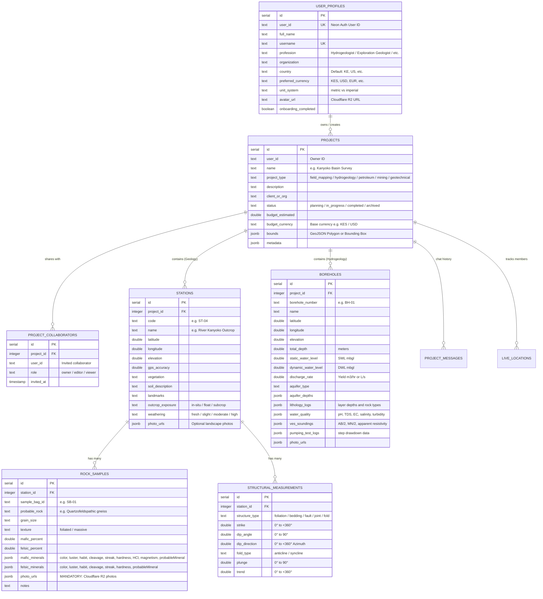

# 🌍 GeoQuerry Backend — Master Architecture Specification

This document records the complete, agreed-upon architectural design decisions established during the system alignment interview.

---

## 🏛️ 1. System Architecture & Tech Stack

* **Server Runtime**: Node.js, Express, TypeScript (NodeNext / ES2022)
* **Cloud Database**: Serverless PostgreSQL 18 via **Neon**
* **ORM & Migrations**: **Drizzle ORM** (`drizzle-orm`, `drizzle-kit`)
* **Validation Layer**: **Zod** (strict runtime boundary validation)
* **Authentication**: **Neon Auth / Better Auth** (Universal Bearer JWT & Session Cookies for Web, Desktop Tauri, and Mobile)
* **Object Storage**: **Cloudflare R2** (S3-compatible, $0 egress bandwidth charges)
* **Real-Time Live Collaboration**: **Server-Sent Events (SSE)** scoped per project

---

## 🗄️ 2. Core Entities & Relational Data Model

---

## 🎯 3. Core Architecture Decisions

### A. Multi-Discipline Hybrid Projects
* Projects can hold both **Geological Outcrop Stations** and **Hydrogeological Boreholes** simultaneously.
* The selected `projectType` drives the primary UI layout, default templates, and dashboard metrics.

### B. Spatial Representation & GIS Readiness
* All points store raw decimal float `latitude`, `longitude`, and `elevation`.
* Survey areas and traverse tracks are stored and served as standard **GeoJSON FeatureCollections** for immediate rendering in MapLibre / Leaflet.

### C. Direct Cloudflare R2 Uploads
* Client requests a 1-time signed upload URL (`POST /api/uploads/presigned-url`).
* Client uploads binary images directly to Cloudflare R2 with live progress tracking.
* Server bandwidth is never consumed by multi-megabyte photo transfers.
* $0 egress fees allow viewing high-resolution field photos infinitely without bandwidth bills.

### D. Real-Time Team Collaboration & SSE Stream
* Live channel: `GET /api/projects/:projectId/events` (Server-Sent Events).
* Teammates broadcast live GPS coordinates (every 15–30s) rendered as moving markers on the web dashboard map.
* Instant team chat and observation notifications (new rock samples or borehole logs appear live on all screens).

### E. Reporting & Multi-Format Exporter
1. **GeoJSON**: For GIS spatial layers (QGIS, ArcGIS).
2. **CSV / Tabular**: For geochemical assays, borehole lithology tables, and pump test curves.
3. **Formatted Printable / PDF Report**: Comprehensive executive summary with maps, mineral deductions, and photo galleries.
4. **Project Sharing**: Share link / invite system for collaborators with role-based permissions (Viewer, Editor).

---

## 🛣️ 4. Action Plan & Roadmap

- [x] **Phase 1: Project Scaffolding & Database Connection**
  - [x] Express + TypeScript + Drizzle ORM + Neon PostgreSQL
  - [x] `src/db/schema.ts` relational tables

- [x] **Phase 2: Geological Field Mapping Engine**
  - [x] `src/routes/stations.ts` (Stations CRUD + Relational queries)
  - [x] `src/routes/rocks.ts` (Rock samples with mandatory photos & deductive mineralogy)
  - [x] `src/routes/structures.ts` (3D structural orientation: strike, dip, plunge, fold)
  - [x] `src/routes/profiles.ts` (User profiling, country-to-currency auto-inference)

- [x] **Phase 3: Multi-Domain Project & Collaboration Engine**
  - [x] `src/routes/projects.ts` (Project creation, domain selection, collaborator sharing)
  - [x] `src/routes/hydrogeology.ts` (Borehole logs, aquifers, water tests, VES resistivity curves)

- [x] **Phase 4: Cloudflare R2 Storage & Presigned URLs**
  - [x] `src/routes/uploads.ts` (Direct S3/R2 presigned upload generator with zero egress fees)

- [x] **Phase 5: Real-Time Team Collaboration (SSE)**
  - [x] `src/routes/events.ts` (Server-Sent Events stream, live GPS member tracking, project chat stream)

- [x] **Phase 6: Reporting & Export Engine**
  - [x] `src/routes/reports.ts` (GeoJSON spatial export, CSV tabular export, structured executive summary)

- [ ] **Phase 7: Final Neon Auth UI & Protected Route Integration**
  - [ ] Connect Better Auth / Neon Auth session verification middleware

